# CAsimulations

```CAsimulations``` proporciona una manera de simular fenómenos asociados con la propagación de enfermedades, basándose en modelos *SIR* y *SIS* implementados en autómatas celulares en Python. ```CAsimulations``` incluye una gran variedad de utilidades para análisis epidemiológicos tales como la capacidad de definir la condición inicial de frontera del sistema, la condición inicial de dispersión de los individuos infectados, variaciones y comparaciones con respecto al cambio de escala y al cambio de frontera del sistema, variaciones promedio para un número arbitrario de simulaciones, entre otros. 

### Instalación
Solo debemos usar pip para instalar:

```pip install -i https://test.pypi.org/simple/ casimulation==0.0.0.2```
### Preliminares
Se decidió implementar una interpolación tipo spline cubica para la correcta visualización de los datos obtenidos a partir de listas de coordenadas. ```spline3``` genera los coeficientes de los polinomios cúbicos que mejor se aproximan a la lista ```A``` .
#### spline3(A)
Realice una interpolación cubica tipo spline, tomando como puntos los elementos de A.
###### Parámetros:
```
A: list   #Lista de coordenadas.
```
###### Devoluciones:
```
np.array    #Arreglo de puntos al aplicar un spline cubico.
```
##### Ejemplo:
```
>>> from CAsimulation import camodels as cm
>>> Point_list=[[1,0.2],[2,2.7],[3,3],[4,1],[5,2]]
>>> cm.spline3(Point_list)
array([[ 0.2       ,  2.87142857,  0.        , -0.37142857],
       [ 2.7       ,  1.75714286, -1.11428571, -0.34285714],
       [ 3.        , -1.5       , -2.14285714,  1.64285714],
       [ 1.        , -0.85714286,  2.78571429, -0.92857143]])
```
####  one_function_graph(A, x)
Graficá el spline cubico para los elementos de A.
###### Parámetros:
```
A: list   #Lista de coordenadas de la función x
x: str    #Nombre de la función
```
###### Devoluciones:
```
.plt    #Gráfica de la función x 
```
#### one_state_graph(A, x)
Graficá el spline cubico para los elementos de A de manera normalizada
###### Parámetros:
```
A: list   #Lista de coordenadas de la función x
x: str    #Nombre de la función
```
###### Devoluciones:	
```
.plt    #Gráfica de la función normalizada x 
```
#### two_states_graph(A, B, X, Y, Z)
Graficá el spline cubico para los elementos de A y B
###### Parámetros:	
```
A: list   #Lista de coordenadas de la función x 
B: list   #Lista de coordenadas de la función y
x: str    #Nombre de la primera función
y: str    #Nombre de la segunda función
z: str    #Título del gráfico
```
###### Devoluciones:	
```
.plt    #Gráfica de las funciones x e y con título z
```
#### three_states_graph(A, B, C, x, y, z, w)
Graficá el spline cubico para los elementos de A, B y C
###### Parámetros: 	
```
A: list   #Lista de coordenadas de la función x
B: list   #Lista de coordenadas de la función y
C: list   #Lista de coordenadas de la función z
x: str    #Nombre de la primera función
y: str    #Nombre de la segunda función
z: str    #Nombre de la tercera función
w: str    #Título del gráfico 
```
###### Devoluciones:	
```
.plt    #Gráfica de las funciones x, y, z con título w
```
### Autómatas celulares 2-dimensionales
Para el caso de AC en dos dimensiones, encontramos una gran variedad de vecindarios, sin embargo, para los intereses de investigación analizamos la vecindad de Moore, que consideran los vecinos diagonales y ortogonales.


#### array_generator(A, i, j)
Genera la vecindad de Moore para la célula en la fila i columna j
###### Parámetros: 	
```
A: np.array   #Arreglo donde se aplicará el modelo epidemiológico
I: int        #Fila i de A
J: int        #Fila j de A
```
###### Devoluciones:	
```
np.array    #Vecindad de Moore de la célula en la fila i columna j
```
Inicialmente debemos identificar dos estados básicos en la simulación basada en modelos de propagación. El primero de ellos será el estado de susceptibilidad, los agentes (píxeles o componentes de la matriz) que tengan este estado, podrán adquirir la enfermedad y por otro lado tendremos los individuos que cuenten con el estado de infección, los cuales podrían infectar a los individuos susceptibles.

Identificaremos los estados *susceptible* e *infectado* con los valores numéricos 0 (cero) y 1 (uno) respectivamente.

#### vector_S(A)
Genera la lista de posiciones de individuos susceptibles, los cuales identificamos con 0 (cero)
###### Parámetros:
```
A: np.array   #Arreglo donde se aplicará el modelo epidemiológico
```
###### Devoluciones:
```
list    #Lista de posiciones de individuos susceptibles
```
#### vector_I(A)
Genera la lista de posiciones de individuos infectados, identificados con 1 (uno)	
###### Parámetros:	
```
A: np.array   #Arreglo donde se aplicará el modelo epidemiológico
```
###### Devoluciones:	
```
list    #Vector de posiciones de individuos infectados
```
##### Ejemplo:
```
>>> import random
>>> random_matrix = [[random.randint(-1,3) for e in range(6)] for e in range(8)]
>>> random_matrix
[[3, 1, 0, 1, 1, 2],
 [0, 1, -1, -1, 2, 1],
 [-1, 1, 1, 0, 2, 0],
 [0, -1, 2, -1, 1, -1],
 [0, 2, 1, -1, -1, 2],
 [-1, -1, 3, 1, 0, 2],
 [3, 3, 2, 2, -1, 3],
 [1, 2, -1, -1, 3, 3]]
>>> cm.array_generator(random_matrix, 3,4)
array([[ 0.,  2.,  0.],
       [-1.,  1., -1.],
       [-1., -1.,  2.]])
>>> import numpy as np
>>> random_matrix=np.array(random_matrix)
>>> cm.vector_S(random_matrix)
[[0, 2], [1, 0], [2, 3], [2, 5], [3, 0], [4, 0], [5, 4]]
>>> cm.vector_I(random_matrix)
[[0, 1], [0, 3], [0, 4], [1, 1], [1, 5], [2, 1], [2, 2], [3, 4], [4, 2], [5, 3], [7, 0]]
```
## Modelos epidemiológicos en AC
Para comenzar con nuestro estudio en los modelos epidemiológicos usando AC, es importante definir los estados modelo. Trabajaremos con estados susceptibles *S*, infectados *I*, recuperados *R* y muertos *D*, adicionalmente incluiremos el estado vació *V* en nuestro modelo, esto permitirá realizar un análisis en el cambio de la topología de la vecindad de Moore, está noción se explicara de manera mas precisa en secciones posteriores. De esta manera, el conjunto de estados estará dado por $\sum=\{S,I,R,D,V\}$. 

Representaremos con los colores amarillo, rojo, verde y blanco los estados *S*, *I*, *R* y *D* respectivamente. En la siguiente ilustración se muestran únicamente uno de los casos posibles de permutación por cada estado de interacción la vecindad. 

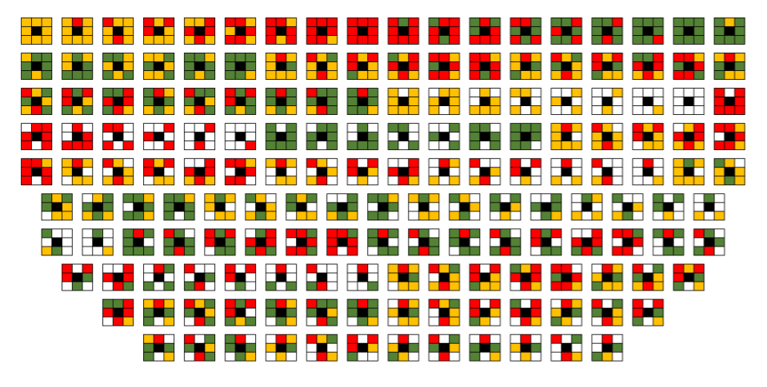

Para plantear adecuadamente la regla de evolución local, debemos implementar una manera de contar los individuos que tengan un estado especifico en algún tiempo $t$ y en una vecindad determinada. Las funciones ```sumaS, sumaI``` y ```sumaR``` nos permiten contar la cantidad de vecinos que sean susceptibles, infectados o recuperados respectivamente, además de incluir la función ```sumaV``` que nos permite contar la cantidad de espacios vacíos en la vecindad a estudiar.

#### sumaS(V)
cantidad de individuos susceptibles en la vecindad
###### Parámetros:
```
V: np.array   #Vecindad
```
###### Devoluciones:
```
int   #Cantidad de individuos susceptibles en la vecindad V
```
#### sumaI(V)
cantidad de individuos infectados en la vecindad
###### Parámetros: 	
```
V: np.array   #Vecindad
```
###### Devoluciones:	
```
int   #Cantidad de individuos infectados en la vecindad V
```
#### sumaR(V)
cantidad de individuos recuperados en la vecindad
###### Parámetros: 	
```
V: np.array   #Vecindad
```
###### Devoluciones:	
```
int   #Cantidad de individuos recuperados en la vecindad V
```
#### sumaV(V)
cantidad de espacios vacíos en la vecindad
###### Parámetros: 	
```
V: np.array   #Vecindad
```
###### Devoluciones:	
```
int   #Cantidad de espacios vacíos en la vecindad V
```
##### Ejemplo:
```
>>> V = cm.array_generator(random_matrix, 6, 3)
>>> print(cm.sumaS(V), cm.sumaI(V), cm.sumaR(V), cm.sumaV(V))
1 1 1 3
```
#### color(A)
La función ```color``` nos permite graficar el entorno espacial de ina manera intuitiva en una escala de colores rgb, usando la paleta nipy_spectral de Python.
###### Parámetros:
```
A: np.array   #Arreglo donde se aplicará el modelo epidemiológico
```
###### Devoluciones:	
```np.array   #Arreglo con entradas en escala rgb```
##### Ejemplo:
```
>>> import matplotlib.pyplot as plt
>>> plt.imshow(cm.color(random_matrix),cmap="nipy_spectral", interpolation='nearest')
```

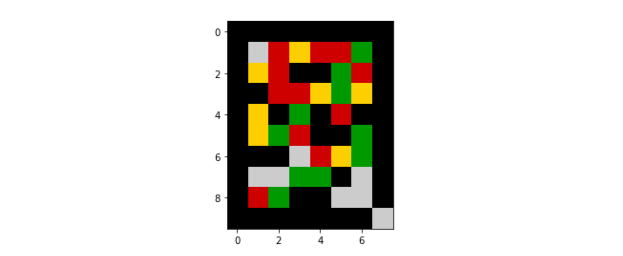

Las funciones ```count_S, count_I, count_R``` y ```count_D``` nos permiten conocer el número exacto de individuos pertenecientes a alguno de los estados *S, I, R* o *D*, mientras que con las funciones ```count_s, count_i, count_r``` y ```count_d``` podemos conocer el promedio de individuos con un estado especifico con respecto a la cantidad de píxeles no vacíos.

#### count_S(A)
Cantidad de individuos susceptibles
###### Parámetros:	
```
A: np.array   #Arreglo donde se aplicará el modelo epidemiológico
```
###### Devoluciones: 	
```
int   #Cantidad de individuos susceptibles en el sistema A
```
#### count_I(A)
Cantidad de individuos infectados
###### Parámetros:	
```
A: np.array   #Arreglo donde se aplicará el modelo epidemiológico
```
###### Devoluciones:	
```
int   #Cantidad de individuos infectados en el sistema A
```
#### count_R(A)
Cantidad de individuos recuperados
###### Parámetros:	
```
A: np.array   #Arreglo donde se aplicará el modelo epidemiológico
```
###### Devoluciones:	
```
int   #Cantidad de individuos recuperados en el sistema A
```
#### count_D(A)
Cantidad de individuos muertos
###### Parámetros:	
```
A: np.array   #Arreglo donde se aplicará el modelo epidemiológico
```
###### Devoluciones:	
```
int   #Cantidad de individuos recuperados en el sistema A
```
#### num_individuals(A)
Cantidad de espacios no vacíos
###### Parámetros:	
```
A: np.array   #Arreglo donde se aplicará el modelo epidemiológico
```
###### Devoluciones:
```
int   #Cantidad de espacios no vacíos en el sistema A
```
#### count_s(A)
Promedio de individuos susceptibles
###### Parámetros: 	
```
A: np.array   #Arreglo donde se aplicará el modelo epidemiológico
```
###### Devoluciones:	
```
float   #Promedio de individuos susceptibles en el sistema A con respecto a la cantidad de espacios no                                                   vacíos
```
#### count_i(A)
Promedio de individuos infectados
###### Parámetros:	
```
A: np.array   #Arreglo donde se aplicará el modelo epidemiológico
```
###### Devoluciones:	
```
float   #Promedio de individuos infectados en el sistema A con respecto a la cantidad de espacios no vacíos
```
#### count_r(A)
Promedio de individuos recuperados
###### Parámetros: 	
```
A: np.array   #Arreglo donde se aplicará el modelo epidemiológico
```
###### Devoluciones:
```
float   #Promedio de individuos recuperados en el sistema A con respecto a la cantidad de espacios no vacíos
```
#### count_d(A)
Promedio de individuos muertos
###### Parámetros:
```
A: np.array   #Arreglo donde se aplicará el modelo epidemiológico
```
###### Devoluciones:
```
float   #Promedio de individuos muertos en el sistema A con respecto a la cantidad de espacios no vacíos
```
##### Ejemplo:
```
>>> print(cm.count_S(random_matrix), cm.count_I(random_matrix), cm.count_R(random_matrix), cm.count_D(random_matrix))
7 11 10 7
>>> print(cm.num_individuals(random_matrix))
35
>>> print(cm.count_s(random_matrix), cm.count_i(random_matrix), cm.count_r(random_matrix), cm.count_d(random_matrix))
0.2 0.3142857142857143 0.2857142857142857 0.2
```
### La regla base de evolución y el modelo *SIS*
Una vez dicho esto considere los siguientes eventos:

1.   Si $\beta>\alpha$, es decir, si el individuo tiene un estado de susceptibilidad la probabilidad de adquirir la infección es mas alta que la probabilidad de mantenerse sano, mientras que si el individuo se encuentra infectado la probabilidad de mantenerse en ese estado sera mayor que la probabilidad de pasar al estado susceptible; debemos tener también en cuenta que el indicador $N_{ij}^t(I)$ sera de vital importancia debido a que a mayor valor de $N_{ij}^t(I)$ mayor sera la probabilidad de infectarse independientemente de el parámetro  $\beta$, teniendo esto en cuenta la regla para este evento sera:

    $$\textit{"Si }x_{i,j}^{t}=0\textit{, }N_{ij}^t(I)>N_{ij}^t(S)\textit{ y }\rho>\frac{\beta}{\alpha}\cdot \frac{N_{ij}^t(I)}{8}\cdot100\textit{ entonces }x_{ij}^{t+1}=1\textit{"}$$
    
    donde $\rho$ es un valor aleatorio entre 0 y 100, de igual manera se define la siguiente regla:
    $$\textit{"Si }x_{i,j}^{t}=1\textit{ y }\rho<\frac{\beta}{\alpha}\cdot \frac{N_{ij}^t(I)}{8}\cdot100\textit{, entonces }x_{ij}^{t+1}=1\textit{"}$$
2.   Si $\beta<\alpha$, es decir, si el individuo tiene un estado de infección la probabilidad de adquirir pasar al estado sano es mas alta que la probabilidad de mantenerse infectado, mientras que si el individuo se encuentra sano la probabilidad de mantenerse en ese estado sera mayor que la probabilidad de pasar al estado infectado, teniendo esto en cuenta la regla para este evento sera:
    $$\textit{"Si }x_{ij}^{t}=1\textit{, }N_{ij}^t(I)<N_{ij}^t(S)\textit{ y }\rho\leq\frac{\beta}{\alpha}\cdot \frac{N_{ij}^t(I)}{8}\cdot100\textit{ entonces }x_{ij}^{t+1}=0\textit{"}$$
    de igual manera se define la siguiente regla:
    $$\textit{"Si }x_{ij}^{t}=0\textit{ y }\rho\geq\frac{\beta}{\alpha}\cdot \frac{N_{ij}^t(I)}{8}\cdot100\textit{, entonces }x_{ij}^{t+1}=0\textit{"}$$


Observe que los estados 1. y 2. se pueden representar mediante la siguiente asignación

$$\Phi_{ij}^t(\alpha,\beta)=\left\{\begin{array}{cc}
0 & \textrm{si }\rho\leq\frac{\beta}{\alpha}\cdot \frac{N_{ij}^t(I)}{8}\cdot100\\
1 & \textrm{en otro caso}
\end{array}\right.$$

Claramente la asignación $\Phi_{ij}^t$ corresponde a una regla totalística, se decidió hacer uso de estas reglas sobre autómatas celulares debido a la complejidad encontrada en la variedad de vecindades que puede tener un agente perteneciente a cualquiera de los dos estados.

De manera forma definimos la *regla base de interacción local* como

\begin{equation}
\Phi_{ij}^t(\alpha,\beta)=\left\{\begin{array}{cc}
0 & \textrm{si }r\leq\frac{\beta}{\alpha}\cdot \frac{N_{ij}^t(I)}{8}\cdot100\\
1 & \textrm{en otro caso}
\end{array}\right.
\end{equation}

donde $\alpha$ y $\beta$ representan la tasa de recuperación y la tasa de infección, respectivamente.

*Observación:* Como veremos más adelante, la cantidad de individuos que interactúan en la vecindad no necesariamente es 8, esto se deberá a que los individuos que posean el estado vació se mantendrán en ese estado para todo tiempo $t$, de esta forma el comportamiento del individuo central no se verá afectado por los espacios vacíos, por lo tanto una consideración importante en nuestra regla base de interacción local, será la cantidad de vecinos que interactúan con la célula central, de esta forma:

\begin{equation}
\Phi_{ij}^t(\alpha,\beta)=\left\{\begin{array}{cc}
0 & \textrm{si }r\leq\frac{\beta}{\alpha}\cdot \frac{N_{ij}^t(I)}{8-N_{ij}^t(V)}\cdot100\textrm{, si }N_{ij}^t(V)\neq8\\
1 & \textrm{en otro caso}
\end{array}\right.
\end{equation}
#### base_rule(alpha, beta, V)
Aplica la regla base de interacción local 
###### Parámetros:	
```
alpha: float      #Tasa de recuperación
beta:  float      #Tasa de infección
V:     np.array   #Vecindad 
```
###### Devoluciones:	
```
float   #Si es 1, el individuo en la célula central de se infectó o se mantuvo enfermo. Si es 0, el individuo en la célula central paso a un estado de susceptibilidad o se mantuvo susceptible
```
##### Ejemplo:
```
>>> cm.base_rule(0.2,0.5,V)
1.0
```
Una vez dicho esto, podemos definir un comportamiento tipo *SIS*, el cual puede entenderse como una regla de interacción entre dos estados (susceptible e infectado). Para poder generar este tipo de dinámica basta con aplicar la regla base de evolución a cada uno de los agentes del sistema.
#### evolution_sis(alpha, beta, U)
Aplica la regla base de interacción global
###### Parámetros:	
```
alpha: float      #Tasa de recuperación
beta:  float      #Tasa de infección
U:     np.array   #Arreglo donde se aplicará el modelo epidemiológico
```
###### Devoluciones: 	
```
np.array    #Evolución del sistema al aplicar la regla base de interacción global
```
##### Ejemplo:
```
>>> random_matrix_2 =  np.array([[random.randint(0,1) for e in range(6)] for e in range(8)])
>>> cm.evolution_sis(0.2,0.5,random_matrix_2)
array([[1, 0, 1, 1, 1, 1],
       [1, 1, 1, 1, 1, 1],
       [1, 1, 1, 1, 1, 1],
       [1, 1, 1, 1, 1, 1],
       [1, 1, 1, 1, 1, 1],
       [0, 1, 1, 1, 1, 1],
       [0, 1, 1, 1, 0, 0],
       [1, 1, 1, 1, 1, 1]])
```
Si usamos la función color obtenemos:

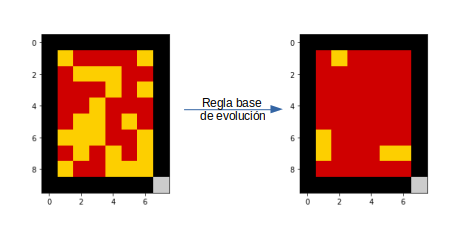

Teniendo en cuenta la manera en la que se definió la regla de evolución, podemos analizar el comportamiento de alguna enfermedad en el sistema ```random_matrix_2``` para un número *tf* de iteraciones, este tipo de análisis los podemos realizar usando la función ```evolution_SIS```.

#### evolution_SIS(alpha, beta, tf, A)
Aplica la regla base de interacción global al sistema tf veces
###### Parámetros:	
```
alpha: float      #Tasa de recuperación
beta:  float      #Tasa de infección
tf:    int        #Cantidad de iteraciones
A:     np.array   #Arreglo donde se aplicará el modelo epidemiológico
```
###### Devoluciones:	
```
list    #Lista cuyos elementos son la evolución del sistema A desde el tiempo 0 hasta el tiempo tf
```
Finalmente, para el caso del modelo *SIS* se implemento una función ```SIS_model``` que fuera capaz de reunir las cantidades de individuos por estado junto con sus valores normalizados y la visualización del cambio generado por la regla de evolución en el sistema. 
#### SIS_model(alpha, beta, tf, A)
Modelo SIS
###### Parámetros:	
```
alpha: float      #Tasa de recuperación
beta:  float      #Tasa de infección
tf:    int        #Cantidad de iteraciones
A:     np.array   #Arreglo donde se aplicará el modelo epidemiológico
```
###### Devoluciones:	
```
list    #Contiene las coordenadas (x,n^x(S)) donde x es una iteración y n^x(S) es la cantidad de individuos susceptibles normalizada. las coordenadas (x,n^x(I)) donde x es una iteración y n^x(I) es la cantidad de individuos infectados normalizada
```
Intentemos ahora definir una condición inicial para el sistema, basada en el porcentaje de individuos infectados que queremos incluir, es decir, si quisiéramos generar una condición inicial de *10%* de infectados, esto es equivalente a decir que 1 de cada 10 individuos tiene la enfermedad. La función ```num_I``` nos permite definir la razón a:b de infectados y la función ```initial_condition``` nos permite aplicarla en la condición inicial del sistema.
#### num_I(a,b)
Porcentaje de infectados 
###### Parámetros:
```
a: int    #Cantidad de infectados por cada b habitantes
b: int    #Cantidad de habitantes
```
###### Devoluciones:	
```list   #Retorna la lista con una cantidad a de infectados con respecto a una población de tamaño b```
#### initial_condition(I0, A)
Define la condición inicial del sistema
###### Parámetros: 	
```
I0: float       #Porcentaje de individuos infectados en el sistema 
A:  np.array    #Arreglo sobre el modelo epidemiológico
```
###### Devoluciones:
```
np.array    #Condición inicial del sistema
```
##### Ejemplo:
```
>>> system_0 = np.zeros((5,8))
>>> system_0 = cm.initial_condition(0.1, system_0)
>>> system_0
array([[0., 0., 1., 0., 0., 0., 0., 0.],
       [0., 0., 0., 0., 0., 0., 0., 0.],
       [0., 0., 0., 0., 1., 0., 0., 0.],
       [0., 0., 0., 0., 1., 0., 0., 0.],
       [0., 0., 0., 0., 0., 1., 0., 0.]])
>>> plt.imshow(cm.color(system_0),cmap="nipy_spectral", interpolation='nearest')
```

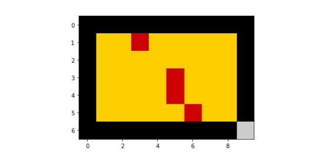


#### graph_sis_S(alpha, beta, tf, A) 
Graficá la cantidad de individuos susceptibles normalizada hasta un tiempo tf
###### Parámetros: 
```
alpha: float      #Tasa de recuperación
beta:  float      #Tasa de infección
tf:    int        #Cantidad de iteraciones
A:     np.array   #Arreglo donde se aplicará el modelo epidemiológico
```
###### Devoluciones: 
```
.plt    #Gráfica que describe la evolución del estado S en el sistema A hasta un tiempo tf
```
##### Ejemplo:
```
>>> cm.graph_sis_S(0.2,0.5,30,system_0)
```
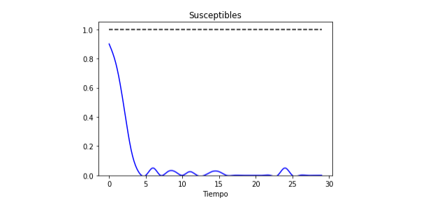

#### graph_sis_I(alpha, beta, tf, A) 
Graficá la cantidad de individuos infectados normalizada hasta un tiempo tf
###### Parámetros: 
```
alpha: float      #Tasa de recuperación
beta:  float      #Tasa de infección
tf:    int        #Cantidad de iteraciones
A:     np.array   #Arreglo donde se aplicará el modelo epidemiológico
```
###### Devoluciones: 
```
.plt    #Gráfica que describe la evolución del estado I en el sistema A hasta un tiempo tf
```
##### Ejemplo:
```
>>> cm.graph_sis_I(0.2,0.5,30,system_0)
```
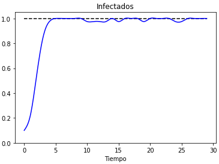

#### graph_sis(alpha, beta, tf, A)
Graficá la cantidad de individuos susceptibles e infectados normalizadas hasta un tiempo tf
###### Parámetros:
```
alpha: float      #Tasa de recuperación
beta:  float      #Tasa de infección
tf:    int        #Cantidad de iteraciones
A:     np.array   #Arreglo donde se aplicará el modelo epidemiológico
```
###### Devoluciones:
```
.plt    #Gráfica que describe la evolución de los estados S e I en el sistema A hasta un tiempo tf
```
##### Ejemplo:
```
>>> cm.graph_sis(0.2,0.5,30,system_0)
```
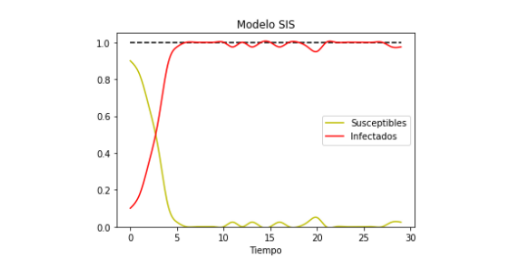

Podemos observar también el comportamiento del sistema mediante el siguiente código:
```
>>> ex_1 = cm.SIS_model(0.2,0.5,10,system_0)[4]
>>> for i in range(10):
......plt.imshow(cm.color(ex_1[i]),cmap="nipy_spectral", interpolation='nearest')
......plt.savefig('ex_1'+str(i)+'.jpg')

>>> import cv2
>>> img_ex_1 = []
>>> for i in range(10):
......img = cv2.imread('ex_1'+str(i)+'.jpg')
......height, width, layers = img.shape
......size = (width,height)
......img_ex_1.append(img)

>>> out = cv2.VideoWriter('ex_1.mp4',cv2.VideoWriter_fourcc(*'DIVX'), 15, size)
 
>>> for i in range(len(img_ex_1)):
......out.write(img_ex_1[i])
>>> out.release()
```


### Las reglas de interacción *SI* , *IR* y el modelo *SIR*
#### Regla de interacción para el estado S
Basándonos en el principio de que los individuos susceptibles a la enfermedad no puedan recuperarse, es decir, un individuo que no haya tenido la enfermedad no podrá curarse de ella. Además, si suponemos también que los individuos que están infectados o recuperados en un tiempo �� no pueden adquirir la cualidad de susceptibilidad para un periodo de tiempo posterior, bien sea porque generaron inmunidad frente a la enfermedad (en el caso de los recuperados) o porque si tiene la enfermedad, no es un paciente con riesgo de adquirir la enfermedad debido a que ya la posee (caso infectado).

La manera en la que se implemento esta regla de interacción fue mediante la función ```interaction_SI``` la cual aplica la ***regla base de evolución*** únicamente a los individuos susceptibles.
#### interaction_SI(alpha, beta, A)
Aplica la regla de interacción del estado S 
###### Parámetros:	
```
alpha: float      #Tasa de recuperación
beta:  float      #Tasa de infección
A:     np.array   #Sistema 
```
###### Devoluciones:	
```
np.array    #Arreglo que cuenta con los individuos que se infectaron, individuos que se mantuvieron susceptibles e individuos que ya se encontraban recuperados
```
#### Regla de interacción para el estado I
Usualmente la tasa de recuperación �� se interpreta como la probabilidad de recuperación individual, para implementar este concepto en ```Casimulations``` se interpreto la tasa de recuperación individual como una tasa de recuperación global, es decir, ��% de las personas infectadas se recuperarán de la enfermedad.

Al igual que en el modelo *SIS*, se impĺementó una función ```num_R ``` la cual se encarga de describir la razón de individuos recuperados frente a individuos infectados.
#### num_R(a, b)
Porcentaje de recuperados
###### Parámetros: 	
```
a: int    #Cantidad de recuperados por cada b infectados
b: int    #Cantidad de infectados
```
###### Devoluciones:	
```list   #Retorna la lista con una cantidad a de recuperados con respecto a una población infectada de tamaño b```
#### interaction_IR(alpha, beta, A)
Aplica la regla de interacción del estado I 
###### Parámetros:	
```
alpha: float      #Tasa de recuperación
beta:  float      #Tasa de infección
A:     np.array   #Sistema 
```
###### Devoluciones:	
```np.array   #Arreglo que cuenta con los individuos que se recuperaron de la enfermedad, individuos que se mantuvieron enfermos e individuos susceptibles```

La regla de interacción para el modelo *SIR* se implemento por medio de la función ```evolution_sir```, con la cual se puede expresar la regla de evolución para el modelo *SIR*  ```evolution_SIR``` para un número tf de iteraciones.
#### evolution_sir(alpha, beta, U)
Aplica la regla que define el comportamiento del modelo sir
###### Parámetros:	
```
alpha: float      #Tasa de recuperación
beta:  float      #Tasa de infección
U:     np.array   #Arreglo donde se aplicará el modelo epidemiológico
```
###### Devoluciones:
```np.array   #Evolución del sistema al aplicar la regla de comportamiento sir```
#### evolution_SIR(alpha, beta, tf, A)
Aplica la regla base de comportamiento sir de manera global al sistema tf veces
###### Parámetros:	
```
alpha: float      #Tasa de recuperación
beta:  float      #Tasa de infección
tf:    int        #Cantidad de iteraciones
A:     np.array   #Arreglo donde se aplicará el modelo epidemiológico
```
###### Devoluciones:	
```list   #Lista cuyos elementos son la evolución del sistema A desde el tiempo 0 hasta el tiempo tf```
#### SIR_model(alpha, beta, tf, A)
Modelo SIR
###### Parámetros:	
```
alpha: float      #Tasa de recuperación
beta:  float      #Tasa de infección
tf:    int        #Cantidad de iteraciones
A:     np.array   #Arreglo donde se aplicará el modelo epidemiológico
```
###### Devoluciones:	
```list   #Contiene las coordenadas (x,n^x(S)), (x,n^x(I)) y (x,n^x(R)) donde las primeras coomponentes de cada coordenada es una iteración y la segunda componente es la cantidad de individuos pertenceciente a los estadoss S, I o R, respectivamente.```

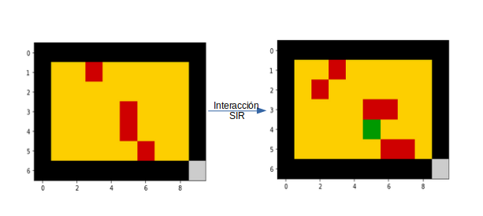

#### graph_sir_S(alpha, beta, tf, A) 
Graficá la cantidad de individuos susceptibles normalizada hasta un tiempo tf
###### Parámetros:
```
alpha: float      #Tasa de recuperación
beta:  float      #Tasa de infección
tf:    int        #Cantidad de iteraciones
A:     np.array   #Arreglo donde se aplicará el modelo epidemiológico
```
###### Devoluciones: 
```.plt   #Gráfica que describe la evolución del estado S en el sistema A hasta un tiempo tf```
##### Ejemplo:
```
>>> cm.graph_sir_S(0.2,0.5,30,system_0)
```
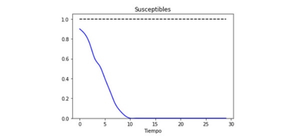

#### graph_sir_I(alpha, beta, tf, A) 
Graficá la cantidad de individuos infectados normalizada hasta un tiempo tf
###### Parámetros:
```
alpha: float      #Tasa de recuperación
beta:  float      #Tasa de infección
tf:    int        #Cantidad de iteraciones
A:     np.array   #Arreglo donde se aplicará el modelo epidemiológico
```
###### Devoluciones:
```.plt   #Gráfica que describe la evolución del estado I en el sistema A hasta un tiempo tf```
##### Ejemplo:
```
>>> cm.graph_sir_I(0.2,0.5,30,system_0)
```
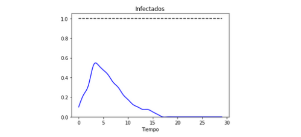

#### graph_sir_R(alpha, beta, tf, A) 
Grafica la cantidad de individuos recuperados normalizada hasta un tiempo tf
###### Parámetros:
```
alpha: float      #Tasa de recuperación
beta:  float      #Tasa de infección
tf:    int        #Cantidad de iteraciones
A:     np.array   #Arreglo donde se aplicará el modelo epidemiológico
```
###### Devoluciones:
```.plt   #Gráfica que describe la evolución del estado R en el sistema A hasta un tiempo tf```
##### Ejemplo:
```
>>> cm.graph_sir_R(0.2,0.5,30,system_0)
```
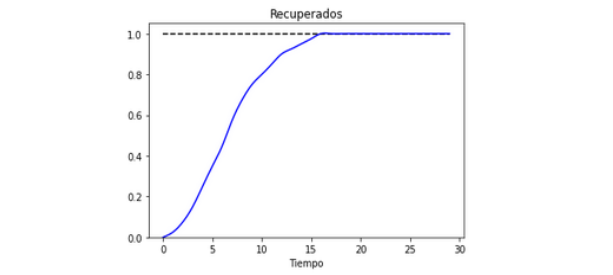

#### graph_sir(alpha, beta, tf, A)
Graficá la cantidad de individuos susceptibles, infectados y recuperados normalizadas hasta un tiempo tf
###### Parámetros:
```
alpha: float      #Tasa de recuperación
beta:  float      #Tasa de infección
tf:    int        #Cantidad de iteraciones
A:     np.array   #Arreglo donde se aplicará el modelo epidemiológico
```
###### Devoluciones:
```.plt   #Gráfica que describe la evolución de los estados S, I y R en el sistema A hasta un tiempo tf```
##### Ejemplo:
```
>>> cm.graph_sir(0.2,0.5,30,system_0)
```
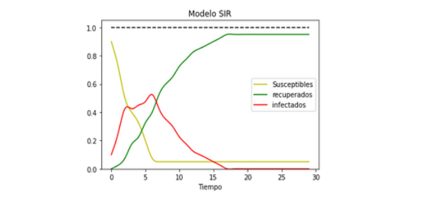

Podemos observar también el comportamiento del sistema mediante el siguiente código:
```
>>> ex_2 = cm.SIR_model(0.2,0.5,20,system_0)[6]
>>> for i in range(20):
......plt.imshow(cm.color(ex_2[i]),cmap="nipy_spectral", interpolation='nearest')
......plt.savefig('ex_2'+str(i)+'.jpg')

>>> import cv2
>>> img_ex_2 = []
>>> for i in range(10):
......img = cv2.imread('ex_2'+str(i)+'.jpg')
......height, width, layers = img.shape
......size = (width,height)
......img_ex_2.append(img)

>>> out = cv2.VideoWriter('ex_2.mp4',cv2.VideoWriter_fourcc(*'DIVX'), 15, size)
 
>>> for i in range(len(img_ex_2)):
......out.write(img_ex_2[i])
>>> out.release()
```
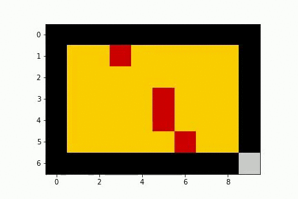
```
A: list       #Lista de coordenadas -- bloque noroeste
B: listlista de coordenadas – bloque norte 
C: list	lista de coordenadas – bloque noreste
D: list	lista de coordenadas – bloque oeste
E: list 	lista de coordenadas – bloque central
F: list	lista de coordenadas – bloque este
G: list	lista de coordenadas – bloque suroeste
H: list	lista de coordenadas – bloque sur
I: list	lista de coordenadas – bloque sureste
J: list	lista de coordenadas – distribución aleatoria	
```
### La dispersión como un factor clave en la velocidad de propagación

Vale la pena preguntarnos si es posible que la ubicación inicial de los individuos infectados afecta el comportamiento de la enfermedad en un periodo de tiempo determinado. Las funciones ```northwest, north, northeast, west, center, east, southwest, south``` y ```southeast``` nos permiten ubicar a casi la totalidad de la población infectada en una de nueve divisiones realizadas sobre el sistema basandonos en los puntos cardinales, también contamos con la función ```aleatorio``` la cual distribuye aleatoriamente a los individuos infectados, cabe resaltar que estas funciones son únicamente para definir la condición inicial del sistema de una manera mas especifica que la función ```initial_condition```.
#### northwest(n, m, I0)
Localiza la población infectada en la zona noroeste del rectángulo
###### Parámetros:
```
n:  int     #Cantidad de filas 
m:  int     #Cantidad de columnas
I0: float   #Porcentaje inicial de individuos infectados
```
###### Devoluciones:
```np.array   #Condición inicial con toda la población infectada en la zona noroeste del sistema rectangular de dimensión n*m ```
#### north(n, m, I0)
Localiza la población infectada en la zona norte del rectángulo 
###### Parámetros:	
```
n:  int          #Cantidad de filas 
m:  int	         #Cantidad de columnas
I0: float	       #Porcentaje inicial de individuos infectados
```
###### Devoluciones:
```np.array   #Condición inicial con toda la población infectada en la zona norte del sistema rectangular de dimensión n*m```
#### northeast(n, m, I0)
Localiza la población infectada en la zona noreste del rectángulo
###### Parámetros:	
```
n:  int     #Cantidad de filas 
m:  int     #Cantidad de columnas
I0: float   #Porcentaje inicial de individuos infectados
```
###### Devoluciones:
```np.array   #Condición inicial con toda la población infectada en la zona noreste del sistema rectangular de dimensión n*m```
#### west(n, m, I0)
Localiza la población infectada en la zona oeste del rectángulo
###### Parámetros:
```
n:  int     #Cantidad de filas 
m:  int     #Cantidad de columnas
I0: float   #Porcentaje inicial de individuos infectados
```
###### Devoluciones:
```np.array   #Condición inicial con toda la población infectada en la zona oeste del sistema rectangular de dimensión n*m```
#### center(n, m, I0)
Localiza la población infectada en la zona central del rectángulo
###### Parámetros:
```
n:  int     #Cantidad de filas 
m:  int     #Cantidad de columnas
I0: float   #Porcentaje inicial de individuos infectados
```
###### Devoluciones:
```np.array   #Condición inicial con toda la población infectada en la zona central del sistema rectangular de dimensión n*m```
#### east(n, m, I0)
Localiza la población infectada en la zona este del rectángulo
###### Parámetros:
```
n:  int     #Cantidad de filas 
m:  int     #Cantidad de columnas
I0: float   #Porcentaje inicial de individuos infectados
```
###### Devoluciones:
```np.array   #Condición inicial con toda la población infectada en la zona este del sistema rectangular de dimensión n*m```
#### southwest(n, m, I0)
Localiza la población infectada en la zona suroeste del rectángulo
###### Parámetros:	
```
n:  int     #Cantidad de filas 
m:  int     #Cantidad de columnas
I0: float   #Porcentaje inicial de individuos infectados
```
###### Devoluciones:
```np.array   #Condición inicial con toda la población infectada en la zona suroeste del sistema rectangular de dimensión n*m```
#### south(n, m, I0)
Localiza la población infectada en la zona sur del rectángulo
###### Parámetros:
```
n:  int     #Cantidad de filas 
m:  int     #Cantidad de columnas
I0: float   #Porcentaje inicial de individuos infectados
```
###### Devoluciones:
```np.array   #Condición inicial con toda la población infectada en la zona sur del sistema rectangular de dimensión n*m```
#### southeast(n, m, I0)
Localiza la población infectada en la zona sureste del rectángulo
###### Parámetros:	
```
n:  int     #Cantidad de filas 
m:  int     #Cantidad de columnas
I0: float   #Porcentaje inicial de individuos infectados
```
###### Devoluciones: 
```np.array   #Condición inicial con toda la población infectada en la zona sureste del sistema rectangular de dimensión n*m```
#### aleatorio(n, m, I0)
Localiza la población infectada de manera uniforme en el rectángulo
###### Parámetros:
```
n:  int     #Cantidad de filas 
m:  int     #Cantidad de columnas
I0: float   #Porcentaje inicial de individuos infectados
```
###### Devoluciones:
```np.array   #Condición inicial con toda la población infectada ubicada de manera uniforme en el sistema rectangular de dimensión n*m```
```CAsimulations``` incluye también maneras de visualizar las zonas de riesgo en un sistema, es posible generar mapas de calor específicos por medio de las funciones ```heatmap_sis, heatmap_sir_I``` y ```heatmap_sir_R```, mientras que los mapas generados por ```heatmap_sis``` y ```heatmap_sir_I``` muestran el comportamiento de la población infectada para los modelos *SIS* y *SIR* respectivamente, la función ```heatmap_sir_R``` nos muestra como evolucionó la población recuperada, es decir, que individuos se recuperaron primero de la enfermedad.
#### heatmap_sis(alpha, beta, tf, A)
Graficá el comportamiento espacial de la enfermedad hasta un tiempo tf
###### Parámetros: 	
```
alpha: float      #Tasa de recuperación
beta:  float      #Tasa de infección
tf:    int        #Cantidad de iteraciones
A:     np.array   #Arreglo donde se aplicará el modelo epidemiológico
```
###### Devoluciones:
```.plt   #Gráfica del mapa de calor que describe como evoluciono la enfermedad en el sistema A hasta un tiempo tf```
#### heatmap_sir_I(alpha, beta, tf, A)
Graficá el comportamiento espacial de la población infectada hasta un tiempo tf para el modelo SIR
###### Parámetros:
```
alpha: float      #Tasa de recuperación
beta:  float      #Tasa de infección
tf:    int        #Cantidad de iteraciones
A:     np.array   #Arreglo donde se aplicará el modelo epidemiológico
```
###### Devoluciones:
```.plt   #Gráfica del mapa de calor que describe como evoluciono la población infectada en el sistema A hasta un tiempo tf para el modelo SIR```
#### heatmap_sir_R(alpha, beta, tf, A)
Graficá el comportamiento espacial de la población recuperada hasta un tiempo tf para el modelo SIR
###### Parámetros:
```
alpha: float      #Tasa de recuperación
beta:  float      #Tasa de infección
tf:    int        #Cantidad de iteraciones
A:     np.array   #Arreglo donde se aplicará el modelo epidemiológico
```
###### Devoluciones:
```.plt   #Gráfica del mapa de calor que describe como evoluciono la población recuperada en el sistema A hasta un tiempo tf para el modelo SIR```
##### Ejemplo:
```
>>> system_1 = cm.northwest(30, 30, 0.1)
>>> plt.imshow(cm.color(system_1), cmap="nipy_spectral", interpolation='nearest')
```
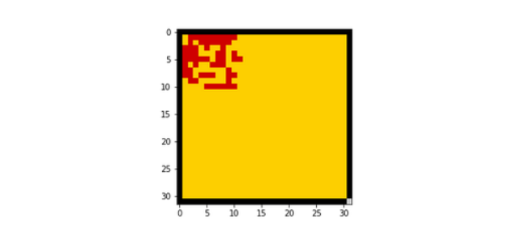
```
>>> cm.heatmap_sis(0.2, 0.5, 30, system_1)
```
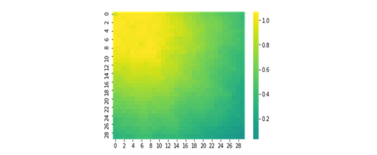
```
>>> cm.heatmap_sir_I(0.2, 0.5, 30, system_1)
```
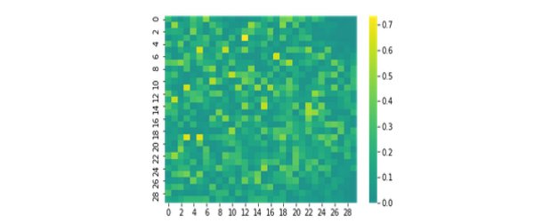
```
>>> cm.heatmap_sir_R(0.2, 0.5, 30, system_1)
```
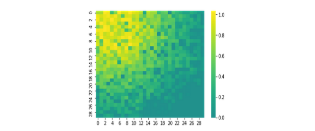
```
>>> ex_3 = cm.SIS_model(0.2, 0.5, 30, system_1)[4]
>>> for i in range(30):
......plt.imshow(cm.color(ex_3[i]),cmap="nipy_spectral", interpolation='nearest')
......plt.savefig('ex_3'+str(i)+'.jpg')

>>> img_ex_3 = []
>>> for i in range(30):
......img = cv2.imread('ex_3'+str(i)+'.jpg')
......height, width, layers = img.shape
......size = (width,height)
......img_ex_3.append(img)

>>> out = cv2.VideoWriter('ex_3.mp4',cv2.VideoWriter_fourcc(*'DIVX'), 15, size)
 
>>> for i in range(len(img_ex_3)):
......out.write(img_ex_3[i])
>>> out.release()
```
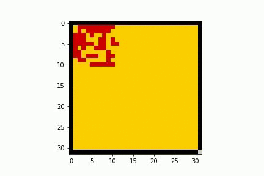
```
>>> ex_4 = cm.SIR_model(0.2, 0.5, 45, system_1)[6]
>>> for i in range(45):
......plt.imshow(cm.color(ex_4[i]),cmap="nipy_spectral", interpolation='nearest')
......plt.savefig('ex_4'+str(i)+'.jpg')

>>> img_ex_4 = []
>>> for i in range(45):
......img = cv2.imread('ex_4'+str(i)+'.jpg')
......height, width, layers = img.shape
......size = (width,height)
......img_ex_4.append(img)

>>> out = cv2.VideoWriter('ex_4.mp4',cv2.VideoWriter_fourcc(*'DIVX'), 15, size)
 
>>> for i in range(len(img_ex_4)):
......out.write(img_ex_4[i])
>>> out.release()
```


Si lo que queremos es analizar el comportamiento para las diferentes condiciones iniciales basadas en los puntos cardinales, podemos utilizar la función ```distribution_graph``` la cual nos permitirá graficar 10 posibles condiciones iniciales.
#### distribution_graph(A, B, C, D, E, F, G, H, I, J)
Graficá la variación presente en los cambios de distribución inicial de población infectada
###### Parámetros: 	
```
A: list   #Lista de coordenadas - bloque noroeste
B: list   #Lista de coordenadas - bloque norte 
C: list   #Lista de coordenadas - bloque noreste
D: list   #Lista de coordenadas – bloque oeste
E: list   #Lista de coordenadas – bloque central
F: list   #Lista de coordenadas – bloque este
G: list   #Lista de coordenadas – bloque suroeste
H: list   #Lista de coordenadas – bloque sur
I: list   #Lista de coordenadas – bloque sureste
J: list   #Lista de coordenadas – distribución aleatoria	 
```
###### Devoluciones:	
```
.plt    #Gráfica de las variaciones bajo cambios en la distribución de población infectada
```
#####  Ejemplo:
```
>>> con_1=cm.SIS_model(0.2, 0.5, 30, cm.northwest(30, 30, 0.1))
>>> con_2=cm.SIS_model(0.2, 0.5, 30, cm.north(30, 30, 0.1))
>>> con_3=cm.SIS_model(0.2, 0.5, 30, cm.northeast(30, 30, 0.1))
>>> con_4=cm.SIS_model(0.2, 0.5, 30, cm.west(30, 30, 0.1))
>>> con_5=cm.SIS_model(0.2, 0.5, 30, cm.center(30, 30, 0.1))
>>> con_6=cm.SIS_model(0.2, 0.5, 30, cm.east(30, 30, 0.1))
>>> con_7=cm.SIS_model(0.2, 0.5, 30, cm.southwest(30, 30, 0.1))
>>> con_8=cm.SIS_model(0.2, 0.5, 30, cm.south(30, 30, 0.1))
>>> con_9=cm.SIS_model(0.2, 0.5, 30, cm.southeast(30, 30, 0.1))
>>> con_10=cm.SIS_model(0.2, 0.5, 30, cm.aleatorio(30, 30, 0.1))
>>> cm.distribution_graph(con_1[0], con_2[0], con_3[0], con_4[0], con_5[0], con_6[0], con_7[0], con_8[0], con_9[0], con_10[0])
```
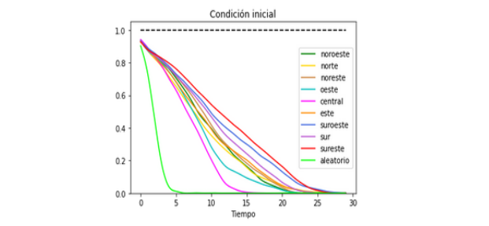
También es posible realizar un gran número de simulaciones, esto con el fin de analizar diferentes condiciones iniciales. Las funciones ```medium_surves_sis``` y ```medium_surves_sir``` son capaces de generar las coordenadas promedio para un número *csim* de simulaciones mientras que las funciones ```graph_medium_curves_sis``` y ```graph_medium_curves_sir``` nos permiten visualizar estos comportamientos "promedio".
#### medium_curves_sis(alpha, beta, tf, csim, I0, A)
Genera las listas de coordenadas promedio al aplicar el modelo sis en una cantidad csim de simulaciones para una condición inicial del I0% de infectados en el espacio
###### Parámetros:	
```
alpha: float      #Tasa de recuperación
beta:  float      #Tasa de infección
tf:    int        #Cantidad de tics
Csim:  int        #Cantidad de simulaciones
I0:    float      #Porcentaje inicial de infectados
A:     np.array   #Sistema sobre el cual se aplica el modelo
```
###### Devoluciones:
```list   #Lista de coordenadas promedio para el estado S, para el estado I y valores en el tiempo de los estados S e I ubicados en listas respectivamente```
#### medium_curves_sir(alpha, beta, tf, csim, I0, A)
Genera las listas de coordenadas promedio al aplicar el modelo SIR en una cantidad csim de simulaciones para una condición inicial del I0% de infectados en el espacio
###### Parámetros:	
```
alpha: float      #Tasa de recuperación
beta:  float      #Tasa de infección
tf:    int        #Cantidad de tics
Csim:  int        #Cantidad de simulaciones
I0:    float      #Porcentaje inicial de infectados
A:     np.array   #Sistema sobre el cual se aplica el modelo
```
###### Devoluciones:
```list   #Lista de coordenadas promedio para los estados S, I y R y valores en el tiempo de los estados S, I y R ubicados en listas respectivamente```
#### graph_medium_curves_sis(alpha, beta, tf, csim, I0, A)
Graficá los valores promedio al aplicar csim veces el modelo sis para un valor inicial fijo de individuos infectados
###### Parámetros:	
```
alpha: float      #Tasa de recuperación
beta:  float      #Tasa de infección
tf:    int        #Cantidad de tics
Csim:  int        #Cantidad de simulaciones
I0:    float      #Porcentaje inicial de infectados
A:     np.array   #Sistema sobre el cual se aplica el modelo
```
###### Devoluciones:
```.plt   #Gráfica con los valores promedio para cada estado del modelo SIS```
#### graph_medium_curves_sir(alpha, beta, tf, csim, I0, A)
Gráfica los valores promedio al aplicar csim veces el modelo SIR para un valor inicial fijo de individuos infectados
###### Parámetros:
```
alpha: float      #Tasa de recuperación
beta:  float      #Tasa de infección
tf:    int        #Cantidad de tics
Csim:  int        #Cantidad de simulaciones
I0:    float      #Porcentaje inicial de infectados
A:     np.array   #Sistema sobre el cual se aplica el modelo
```
###### Devoluciones:
```.plt   #Gráfica con los valores promedio para cada estado del modelo SIR```
##### ejemplos:
```
>>> system_2 = np.zeros((20, 20))
>>> cm.graph_medium_curves_sir(0.2, 0.5, 30, 50, 0.1, system_2)
```
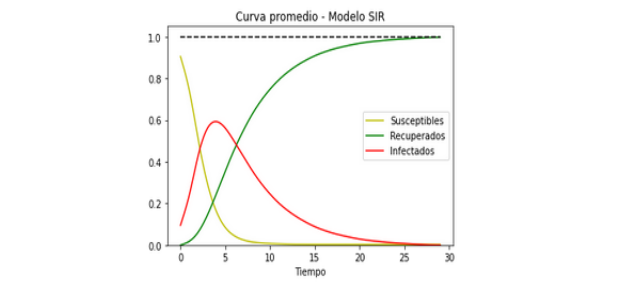
```
>>> cm.graph_medium_curves_sis(0.2,0.5,30,100,0,cm.southeast(15,15,0.1))
```
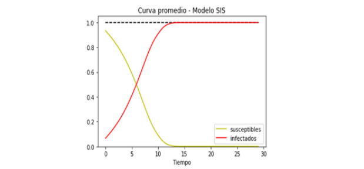
### Análisis cambiando la condición de frontera del sistema
Implementaremos ahora una manera de definir cualquier tipo de sistema, lo primero que debemos hacer es definir el espacio sobre el cual queremos definir nuestro sistema, es decir, si por ejemplo quisiéramos definir una región triangular, lo primero que debemos hacer es definir una región rectangular que lo contenga, posteriormente se debe generar una lista con las coordenadas del sistema. La función ```boundary``` se encarga de convertir cada píxel con coordenadas en la lista que define el sistema en un agente que inicialmente tiene un estado *S*, si buscamos una manera de facilitar el trabajo de definir dicha lista, la función ```domain_definition``` nos permitirá definir bloques o submatrices para abarcar mas espacio en el espacio inicial.
#### boundary(L,M)
Genera sub-matrices nulas en la matriz M
###### Parámetros:
```
L: list       #Lista de coordenadas que se anularan para definir donde se aplican los modelos epidemiológicos
M: np.array   #Arreglo sobre el cual se definen las condiciones iniciales de entorno de ejecución de los modelos epidemiológicos
```
###### Devoluciones: 
```np.array   #Sistema en el cual se aplican los modelos bajo condiciones no regulares de frontera```
#### domain_definition(n, m, a, b, M)
Define y genera las sub-matrices nulas donde se aplicarán los análisis epidemiológicos
###### Parámetros:	
```
n: int        #Cantidad de filas de la sub-matriz
m: int        #Cantidad de columnas de la sub-matriz
a: int        #Fila en la cual se va a ubicar la sub-matriz
b: int        #Columna en la cual se va a ubicar a sub-matriz
M: np.array   #Arreglo sobre el cual se va a generar la sub-matriz nula
```
###### Devoluciones: 
```np.array   #Sistema en el cual se aplican los modelos bajo condiciones no regulares de frontera```
##### Ejemplo:
```
>>> empty_space = -np.ones((15, 20))
>>> system_2 = cm.boundary([[2, 5], [3, 7], [8, 2], [14, 15]], empty_space)
>>> system_2 = cm.domain_definition(3, 3, 6, 12, system_2)
>>> system_2 = cm.domain_definition(4, 2, 8, 7, system_2)
>>> plt.imshow(cm.color(system_2),cmap="nipy_spectral", interpolation='nearest')
```

A partir de esto es posible implementar funciones mas complejas para la definición de algún sistema particular, este es el caso de las funciones ```rombo``` y la función ```triangulo```
#### rombo(a, b, c, d, M)
Define un sistema tipo rombo, con vértice izquierdo ubicado en (a, b) y con dimensión de la primera submatriz cxd en el espacio M
###### Parámetros:
```
a: int        #Fila donde se ubica el vértice izquierdo del rombo
b: int        #Columna donde se ubica el vértice izquierdo del rombo
c: int        #Cantidad de filas de la primera submatriz
d: int        #Cantidad de columnas de la primera submatriz
M: np.array   #Espacio donde se definirá el sistema
```
###### Devoluciones:  
```np.array#Arreglo de coordenadas con un sistema tipo rombo```
#### triangulo(n, m, a, b, M)
Define un sistema triangular, con vértice izquierdo ubicado en (n, m) y con dimensión de la primera submatriz axb en el espacio M
###### Parámetros: 
```
n: int        #Fila donde se ubica el vértice izquierdo del triangulo
m: int        #Columna donde se ubica el vértice izquierdo del triangulo
a: int        #Cantidad de filas de la primera submatriz
b: int        #Cantidad de columnas de la primera submatriz
M: np.array   #Espacio donde se definirá el sistema
```
###### Devoluciones:   
```np.array	arreglo de coordenadas con un sistema triangular```
Entre las funciones de graficacion de ```CAsimulations``` también encontramos a ```systems_graph```, la cual nos permite comparar 7 sistemas distintos, esto con el fin de analizar la evolución de la enfermedad para diferentes tipos de sistemas.
#### systems_graph(A, B, C, D, E, F, G)
Graficá los cambios presentes en la condición de frontera
###### Parámetros: 	
```
A: list   #Lista de coordenadas – primera región
B: list   #Lista de coordenadas – segunda región
C: list   #Lista de coordenadas – tercera región
D: list   #Lista de coordenadas – cuarta región
E: list   #Lista de coordenadas – quinta región
F: list   #Lista de coordenadas – sexta región
G: list   #Lista de coordenadas – séptima región
```
###### Devoluciones:	
```
.plt    #Gráfica de los cambios en el modelo tomando condiciones de frontera diferentes
```
Ya sabemos como generar sistemas de cualquier tipo y de cualquier tamaño, es tiempo de ver las posibilidades de los modelos epidemiológicos frente a cambios de escala, si definimos por medio de ```domain_definition``` diferentes escalas para un mismo tipo de sistema, la función ```scale_differences``` nos permitirá ver calcular la variación entre dos escalas, por medio de ```scales_graph``` podremos visualizar los cambios presentes en 5 escalas diferentes, mientras que ```scales_differences_graph``` nos permitirá visualizar las diferencias entre cuatro escalas distintas.
#### scale_differences(L1, L2)
Calcula las diferencias por cada iteración entre dos escalas diferentes
###### Parámetros: 
```
L1: list      #Lista con los valores numéricos obtenidos en una primera escala
L2: list      #Lista con los valores numéricos obtenidos en la segunda escala
```
###### Devoluciones: 
```list	#Lista con las diferencias entre ambas escalas por cada iteración.```
#### scales_graph(A, B, C, D, E)
Graficá los cambios presentes en la variación de escalas
###### Parámetros: 	
```
A: list   #Lista de coordenadas – primera escala
B: list   #Lista de coordenadas – segunda escala
C: list   #Lista de coordenadas – tercera escala
D: list   #Lista de coordenadas – cuarta escala
E: list   #Lista de coordenadas – quinta escala
```
###### Devoluciones:	
```
.plt    #Gráfica de los cambios en el modelo tomando escalas diferentes
```
#### scales_differences_graph(A, B, C, D)
Graficá los cambios presentes en la variación de escalas
###### Parámetros: 	
```
A: list   #Lista de coordenadas – primera escala vs última escala
B: list   #Lista de coordenadas – segunda escala vs última escala
C: list   #Lista de coordenadas – tercera escala vs última escala
D: list   #Lista de coordenadas – cuarta escala vs última escala
```
###### Devoluciones:	
```
.plt    #Gráfica de los cambios en el modelo tomando escalas diferentes
```
